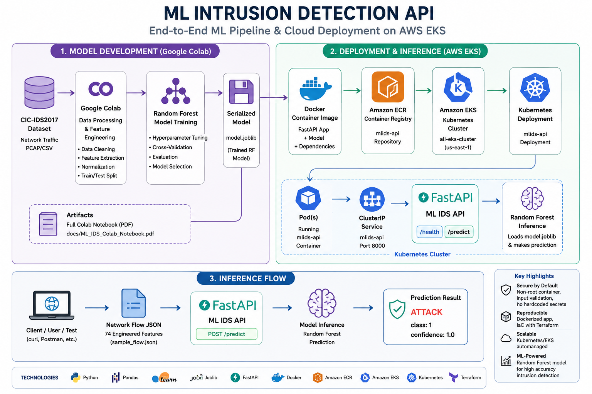
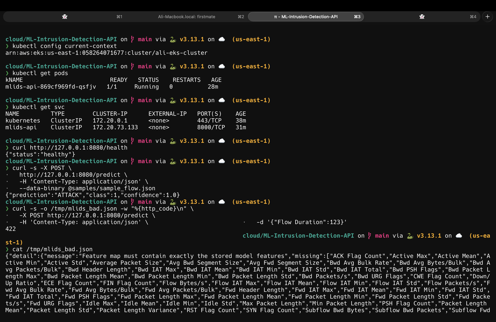
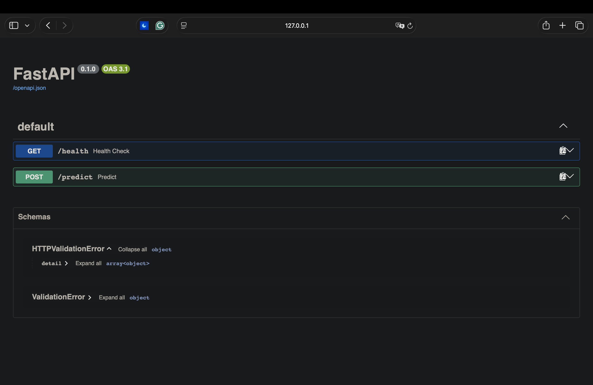
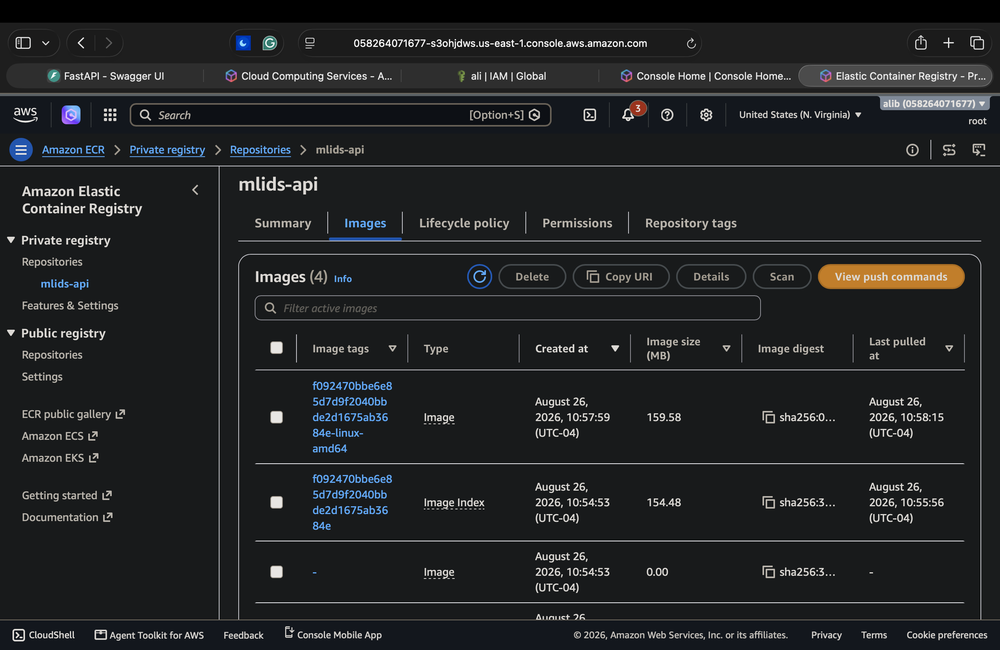

# 🛡️ ML Intrusion Detection API

## Overview

I originally developed the machine learning model behind this project while completing my Master's in Applied Data Intelligence and Machine Learning. The goal of the original project was to explore how supervised machine learning could be applied to cybersecurity, specifically network intrusion detection using the CIC-IDS2017 dataset.

During that project, I worked through the complete machine learning process: preparing network-flow data, selecting useful features, training multiple classification models, and evaluating their ability to distinguish malicious network traffic from benign activity. The Random Forest model performed well and became the final model I selected for intrusion detection.

However, after completing the machine learning portion, I wanted to take the project further.

The original model worked inside Google Colab, but I wanted to understand what happens **after a machine learning model is trained**. How could another application actually use it? How could I expose it through an API? How could I containerize it, deploy it with Kubernetes, and ultimately run it in AWS?

That question turned the original academic project into the end-to-end system documented in this repository.

I serialized the trained Random Forest model, built a FastAPI inference service around it, containerized the application with Docker, deployed it locally with Kubernetes, pushed the container image to Amazon ECR, and ultimately deployed and tested the application on a live Amazon EKS cluster.

The finished workflow demonstrates the progression from:

**Machine Learning Model → API → Docker Container → Amazon ECR → Kubernetes → Amazon EKS → Live ML Inference**

Throughout the project, I also kept security in mind at each layer, including API input validation, controlled error handling, non-root container execution, dependency and container vulnerability review, private image storage, and limiting unnecessary exposure of the application.

---

## 🏗️ Architecture



The architecture follows the model from its original development through deployment and inference.

### Model Development

The CIC-IDS2017 network traffic data is processed and prepared in Google Colab before being used to train and evaluate the Random Forest classifier.

The trained model is serialized with its expected feature structure so that the exact trained model can later be loaded by the API without retraining.

### Deployment

The FastAPI application and serialized model are packaged into a Docker container.

That container image is pushed to a private Amazon ECR repository and then pulled by Amazon EKS, where Kubernetes runs the application inside a Pod.

A Kubernetes Deployment manages the application workload while a ClusterIP Service provides stable internal access to the API.

### Inference

A client sends a JSON request containing the 74 network-flow features expected by the trained model.

FastAPI validates the request and passes the features to the Random Forest model.

The API then returns the model's classification and confidence.

Example:

```json
{
  "prediction": "ATTACK",
  "class": 1,
  "confidence": 1.0
}
```

---

## 🧠 Machine Learning Model

The original machine learning work was completed using the **CIC-IDS2017** dataset, a cybersecurity dataset containing benign traffic alongside several categories of network attacks.

The model-development process included:

- Network traffic data preprocessing
- Data cleaning
- Feature preparation
- Train/test separation
- Training multiple supervised classification models
- Comparing model performance
- Evaluating accuracy, precision, recall, F1 score, and ROC-AUC
- Selecting Random Forest for the final intrusion detection model

For an intrusion detection system, I was particularly interested in **recall and precision**.

Recall is important because a false negative represents malicious traffic that the model failed to identify. Precision is also important because excessive false positives could create unnecessary alerts for a security analyst.

After evaluating the models, I selected Random Forest as the model that would continue into the deployment portion of the project.

Instead of retraining the model when the API starts, the trained Random Forest and its expected feature order are serialized using Joblib and loaded directly by the application.

### Original Model Development

The complete Google Colab notebook documenting the original machine learning work is available here:

📄 [View the ML Intrusion Detection Colab Notebook](docs/ML_Intrusion_Detection_Model_Notebook.pdf)

This notebook contains the original data preparation, model training, evaluation, and model-selection work that became the foundation for this project.

---

## ⚡ FastAPI Inference Service

Once the model was trained, the next challenge was turning it into something another system could actually communicate with.

I used **FastAPI** to create a REST API around the Random Forest model.

The application exposes two primary endpoints:

| Endpoint | Method | Purpose |
|----------|--------|---------|
| `/health` | GET | Confirms that the ML service is running |
| `/predict` | POST | Accepts network-flow features and performs intrusion classification |

### Health Check

```bash
curl http://127.0.0.1:8080/health
```

Response:

```json
{
  "status": "healthy"
}
```

### Prediction

The `/predict` endpoint accepts the 74 network-flow features expected by the trained model.

A successful request returns the predicted classification, class, and model confidence.

Example response:

```json
{
  "prediction": "ATTACK",
  "class": 1,
  "confidence": 1.0
}
```

In a larger security environment, these network-flow features could come from traffic monitoring or flow-generation systems. Instead of interacting directly with the machine learning code, another service could send the required features to the API and consume the resulting classification.

---

## 🔐 API Validation & Security

Moving the model from a notebook into an API introduced a different set of concerns.

A model should not blindly accept whatever data a client sends it.

The `/predict` endpoint therefore validates incoming requests before they reach the Random Forest model.

The API:

- Requires the exact 74 features expected by the stored model
- Rejects missing features
- Rejects unknown features
- Rejects boolean values
- Rejects numeric values supplied as strings
- Rejects NaN and positive/negative infinity
- Preserves the model's original stored feature order regardless of incoming JSON key order
- Returns controlled validation errors for malformed requests
- Prevents internal exceptions, filesystem paths, and stack traces from being exposed to clients

For example, submitting an incomplete feature map results in an HTTP `422` response rather than allowing invalid data to reach the model.

This validation became an important part of the project because deploying a machine learning model involves more than simply calling `model.predict()`.

The interface around the model needs to be reliable as well.

---

## 🐳 Docker

After the API was working, I containerized the application with **Docker**.

The container packages the components needed to run the service consistently:

- Python runtime
- FastAPI application
- Serialized Random Forest model
- Python dependencies
- Application configuration
- Health check

Security was also considered when building the container.

The application runs as a **non-root user**, dependencies are pinned, unnecessary files are excluded from the image, and the resulting container was reviewed for vulnerabilities before deployment.

Containerizing the application gave me a portable artifact that could run locally, inside Kubernetes, or in AWS without rebuilding the application differently for each environment.

---

## ☸️ Kubernetes

Before moving into AWS, I deployed the containerized API to Kubernetes locally.

The Kubernetes architecture intentionally focused on the components needed to run and expose the application:

```text
Deployment
    ↓
Pod
    ↓
ML IDS Container
    ↓
ClusterIP Service
    ↓
FastAPI
```

The **Deployment** defines the desired application workload.

Kubernetes then creates a **Pod** containing the ML IDS Docker container.

A **ClusterIP Service** provides a stable way to reach the application.

This allowed me to verify that the container behaved correctly as a Kubernetes workload before introducing AWS infrastructure.

---

## ☁️ AWS Deployment

After validating the application locally, I deployed the complete system to **Amazon EKS**.

The cloud deployment followed this path:

```text
Docker Image
      ↓
Amazon ECR
      ↓
Amazon EKS
      ↓
Kubernetes Deployment
      ↓
Pod
      ↓
ClusterIP Service
      ↓
FastAPI
      ↓
Random Forest
```

### Amazon ECR

The Docker image was pushed to a private **Amazon Elastic Container Registry (ECR)** repository named:

```text
mlids-api
```

This gave EKS a private AWS-hosted location from which to retrieve the application image.

### Amazon EKS

The application was then deployed to an **Amazon Elastic Kubernetes Service (EKS)** cluster.

Once deployed, I verified the running Kubernetes resources using:

```bash
kubectl get pods
```

The ML IDS Pod reported:

```text
READY   STATUS    RESTARTS
1/1     Running   0
```

I also verified the Kubernetes Service:

```bash
kubectl get svc
```

The application was exposed internally using a `ClusterIP` Service on port `8000`.

Rather than creating unnecessary public-facing infrastructure for testing, I used Kubernetes port forwarding to reach the service:

```bash
kubectl port-forward service/mlids-api 8080:8000
```

This forwarded my local port `8080` to the ML IDS service running inside the EKS cluster.

---

## 🔎 End-to-End ML Inference

With the application running in EKS, I tested the complete system using an actual network-flow sample.

The request traveled through:

```text
Client
  ↓
Kubernetes Service
  ↓
EKS Pod
  ↓
FastAPI
  ↓
Random Forest Model
  ↓
Prediction
```

The sample contained all **74 network-flow features** required by the trained model.

I submitted it using:

```bash
curl -s -X POST \
  http://127.0.0.1:8080/predict \
  -H 'Content-Type: application/json' \
  --data-binary @samples/sample_flow.json
```

The live API returned:

```json
{
  "prediction": "ATTACK",
  "class": 1,
  "confidence": 1.0
}
```

This completed the full progression of the project: the Random Forest model that began inside my graduate machine learning coursework was now performing inference through a REST API running inside a Docker container, orchestrated by Kubernetes, on a live Amazon EKS cluster.

---

# 📸 Project Evidence

## Live EKS + ML API



This was my final end-to-end verification.

The terminal shows:

- Active Amazon EKS Kubernetes context
- Running `mlids-api` Pod
- Kubernetes ClusterIP Service
- Successful `/health` response
- Successful `/predict` inference
- HTTP `422` rejection of an invalid feature request

The successful prediction returned:

```json
{
  "prediction": "ATTACK",
  "class": 1,
  "confidence": 1.0
}
```

---

## FastAPI Interface



FastAPI provides an interactive Swagger interface for inspecting and testing the API.

The interface exposes:

- `GET /health`
- `POST /predict`

This provides a simple way for another developer or system integrator to understand how to interact with the ML service.

---

## Docker Image in Amazon ECR



The Docker image used by the Kubernetes deployment was successfully published to the private `mlids-api` Amazon ECR repository.

Amazon EKS then pulled this image to create the running ML IDS Pod.

This connected the container build process directly to the cloud deployment.

---

## 🧪 Testing & Continuous Integration

I added automated testing around the API and inference contract rather than relying only on manual testing.

The test suite verifies behavior including:

- `/health` availability
- Known attack prediction
- Missing feature rejection
- Unknown feature rejection
- Invalid data types
- Non-finite numeric values
- Malformed JSON
- Stored model feature ordering
- Correct prediction confidence mapping
- Protection against leaking internal exception details

The API test suite contains **18 passing tests**.

GitHub Actions is used to automatically execute the test suite as part of the repository's CI workflow.

Container smoke testing was also incorporated to verify that the built image could successfully start and serve the application.

This gave the project multiple layers of validation:

```text
Unit/API Tests
      ↓
Docker Validation
      ↓
Local Kubernetes
      ↓
Amazon EKS
      ↓
Live API Request
```

---

## 🛡️ Security Considerations

Because this project combines machine learning, cloud infrastructure, APIs, containers, and cybersecurity, I kept security in mind throughout the development and deployment process.

Some of the security measures implemented include:

### API

- Strict feature-map validation
- Input type validation
- Non-finite number rejection
- Controlled HTTP error responses
- Prevention of internal exception leakage

### Container

- Non-root execution
- Pinned dependencies
- Minimal application contents
- Docker health check
- Container vulnerability review

### Kubernetes

- ClusterIP Service
- No unnecessary public application endpoint
- Kubernetes health validation
- Controlled application deployment

### AWS

- Private Amazon ECR repository
- EKS-managed Kubernetes environment
- IAM-based AWS authentication
- Infrastructure lifecycle verification
- Removal of temporary cloud resources after successful testing

The goal throughout the project was not simply to make each technology work individually, but to understand the security implications introduced as the model moved from one layer to the next.

---

## 🏗️ Infrastructure as Code

Terraform was used as part of the AWS infrastructure workflow.

Before creating cloud resources, the Terraform configuration was initialized, validated, and reviewed through a Terraform plan.

The AWS environment included the infrastructure required to support the EKS deployment, including:

- Amazon EKS
- Worker nodes
- VPC networking
- Subnets
- IAM roles
- Supporting AWS resources
- Amazon ECR

The deployment was created specifically for the final end-to-end validation.

After successfully verifying the application and capturing the deployment evidence, the environment was destroyed and the AWS account was checked to confirm that the project-specific EKS and ECR resources had been removed.

This allowed me to practice the **complete infrastructure lifecycle**:

```text
Plan → Provision → Deploy → Validate → Destroy → Verify
```

---

## 💡 What I Learned

What started as a machine learning assignment became one of the most useful projects I've worked through because it forced me to connect technologies that I had previously learned separately.

The original project taught me how to prepare cybersecurity data, train classification models, evaluate their performance, and select an appropriate model.

Extending the project taught me what happens after that point.

I gained hands-on experience taking a trained model and connecting it to:

- A REST API
- Input validation
- Automated testing
- Docker
- Container security
- Kubernetes
- Amazon ECR
- Amazon EKS
- Terraform
- CI with GitHub Actions
- Cloud infrastructure lifecycle management

More importantly, I now have a much stronger understanding of **how these pieces interact as one system**.

A model does not need to live inside the notebook where it was created.

It can become a service that another application can communicate with, package that service into a container, orchestrate it with Kubernetes, store and distribute the image through a cloud registry, and run the complete application on managed cloud infrastructure.

That end-to-end progression was the main reason I chose to continue developing this project after completing the original machine learning work.

---

## 🧰 Technologies Used

| Area | Technologies |
|------|--------------|
| Machine Learning | Python, Pandas, scikit-learn |
| Dataset | CIC-IDS2017 |
| Model | Random Forest |
| Model Serialization | Joblib |
| API | FastAPI, Uvicorn |
| Testing | Pytest |
| Containerization | Docker |
| Container Registry | Amazon ECR |
| Orchestration | Kubernetes |
| Managed Kubernetes | Amazon EKS |
| Infrastructure as Code | Terraform |
| CI | GitHub Actions |
| Cloud Platform | AWS |

---

## 📂 Repository Structure

```text
ML-Intrusion-Detection-API/
│
├── app/
│   └── main.py
│
├── model/
│   └── random_forest_ids.joblib
│
├── samples/
│   └── sample_flow.json
│
├── tests/
│   └── test_api.py
│
├── k8s/
│   └── Kubernetes deployment configuration
│
├── docs/
│   ├── architecture.png
│   ├── ML_IDS_Colab_Notebook.pdf
│   │
│   └── screenshots/
│       ├── eks-api-demo.png
│       ├── fastapi-swagger.png
│       └── ecr-container-image.png
│
├── .github/
│   └── workflows/
│
├── Dockerfile
├── requirements.txt
└── README.md
```

---

## 🚀 Project Journey

This project ultimately became much larger than the machine learning model I originally built.

The progression was:

```text
CIC-IDS2017
      ↓
Data Preparation
      ↓
Machine Learning
      ↓
Random Forest
      ↓
Serialized Model
      ↓
FastAPI
      ↓
Automated Testing
      ↓
Docker
      ↓
Local Kubernetes
      ↓
Amazon ECR
      ↓
Amazon EKS
      ↓
Live Intrusion Prediction
```

Each stage gave me an opportunity to understand another part of taking a machine learning solution from development to deployment while continuing to build on the cybersecurity focus that started the project.

---

## 📄 Additional Documentation

For a deeper look at the machine learning portion of the project:

**[Original ML Intrusion Detection Google Colab Notebook (PDF)](docs/ML_IDS_Colab_Notebook.pdf)**

The notebook documents the original dataset preparation, model experimentation, evaluation, and Random Forest training that provided the foundation for the deployed application.

---

## 👤 Author

**Ahlayah Blain**

Master's in Applied Data Intelligence and Machine Learning

Cybersecurity • AI/ML • Cloud • Linux
